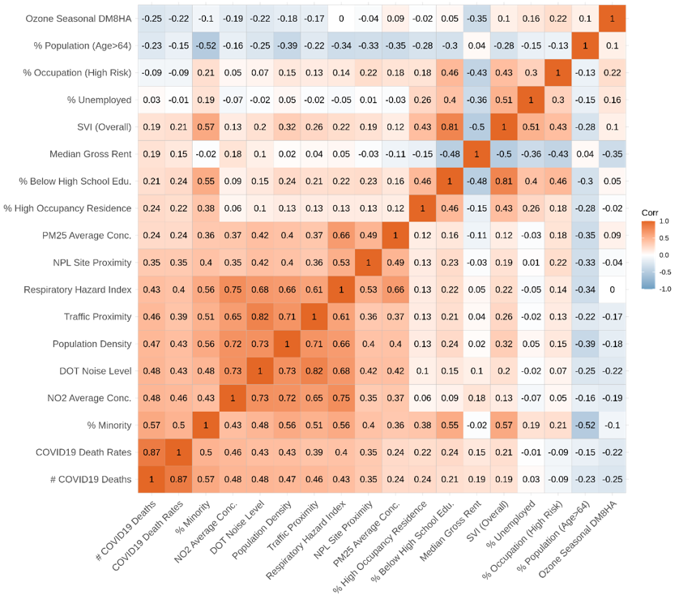
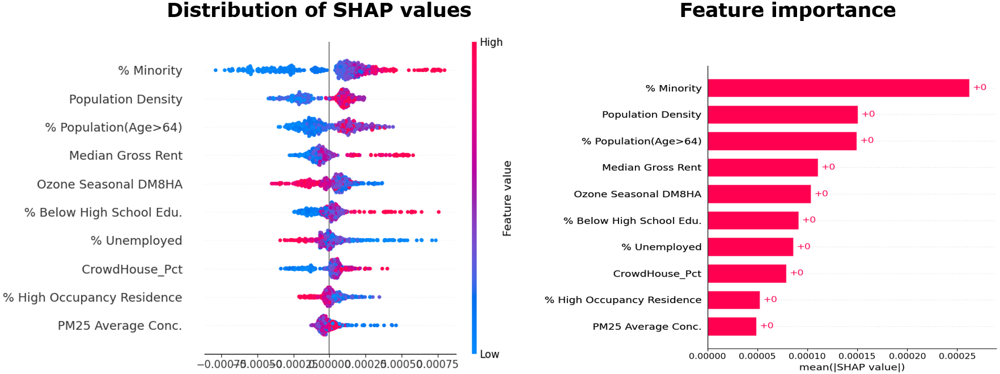
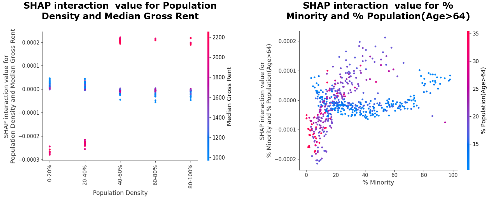
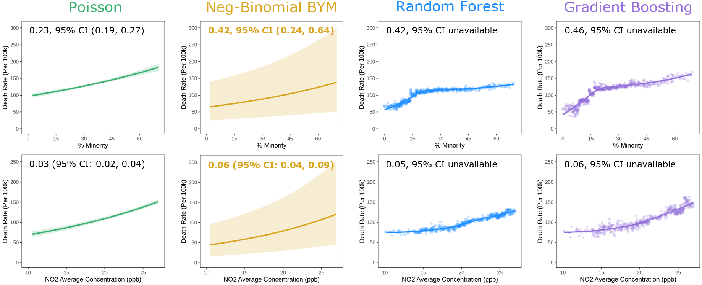

# Erdős Institute Data Science Bootcamp, June 2022.
# CovExper
## Project Description

COVID-19 adverse health outcomes such as mortality rate are associated with multiple Demographic, Environmental and Socioeconomic (DES) factors. Precise estimation of association patterns can help improve the understanding of social and environmental justice issues related to the impact of the pandemic. In this project, we extracted a subset from the COVID-19 socioexposomic data1,2 and developed Interpretable Machine Learning3 (IML) methods to identify important nonlinear health effects and interactions at local (municipality) scale across New Jersey. Our results show that IML can be an effective supplement to traditional statistical and geospatial models for uncovering underlying complex patterns even for small sample sets.

## Team

We have 4 Ph.Ds from diverse backgrounds as part of the Erdos Institute Data Science Bootcamp - 2022.  

* Xiang Ren (Process Systems Engineering)

* Xiaoran Hao (Math)

* Jun Li (Math)

* Zahra Adahman (Neuroscience)

## Data Challenge (Environmental Health Data)

* Small/moderate sample size (~500) 

* Strong inter-correlation 

* Spatial heterogeneity 

* Nonlinear relationships 

* Potential interactions 
 

## Document Description

Data folder includes raw data and intermediate data used for visualiation; Code folder includes two python scripts and two R scripts:

* machine-learning.py: hyperparameter tuning, validation, prediction and interpretaion of two Machine Learning models, i.e., random forest and extreme gradient boosting 

* shap_plot.py: interaction analysis and visualization for the xgboost model 

* statistical-modeling.R: construction, validation, prediction and interpretaion of two statistical models, i.e., poisson regression and negative-binomial bym spatial model 

* visualization.R: correlation heatmap, effects plots from four modeling approaches, etc. 

## Several Results
### SHAP Value and Feature Importance

Left: higher % Minority leads to higher Death Rate, etc. Right: % Minority is the most important feature in the reference model (constructed with 10 variables)

### SHAP Interaction

Left: high Median Gross Rent tends to lower the Death Rate in the low population density area but have opposite impact in the high population density area. Right:
% Minority doesn’t have much impact in the towns with younger population while in the town with older population higher % Minority increases Death Rate.

### Comparison of Predictor/SHAP Effects Plots Estimated from Four Modeling Approaches

Compared to Neg-Binomial BYM model, Poisson regerssion generates overly-optimistic results with much narrower confidence interval; Compared to two statistical models, Machine Learning can capture consistent trends, and furthermore, can identify important nonlinear relationships.

## Final Remarks 
Interpretable Machine Learning (even for small datasets) played a complementary role to advanced geostatistical models: all four modeling approaches can capture similar associations when an underlying exponential relation holds, but Machine Learning can further “learn” non-exponential patterns in the data.

## References:
1. Georgopoulos, PG., Mi, Z., Ren, X., 2021. Socioexposomics of COVID-19: The Case of New Jersey, ISES 2021 
2. Ren, X, Mi, Z., Georgopoulos, PG., 2022. Socioexposomics of COVID-19 across New Jersey: A Comparison of Geostatistical and Machine Learning Approaches. Submitted
3. Molnar, C., 2019. Interpretable Machine Learning: A Guide for Making Black Box Models Explainable
